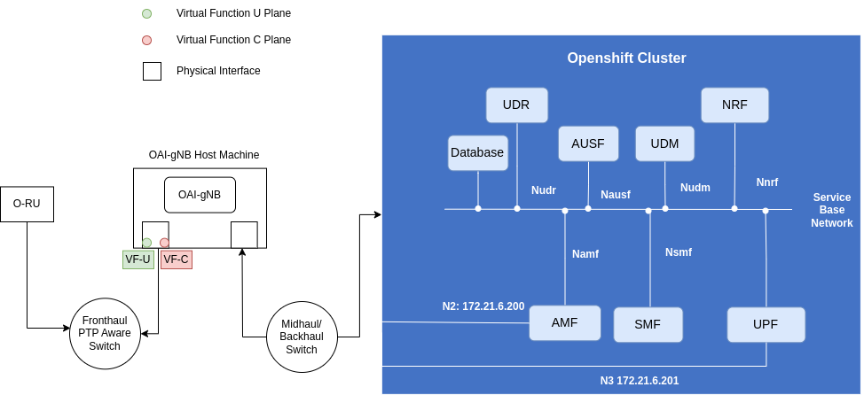

<table style="border-collapse: collapse; border: none;">
  <tr style="border-collapse: collapse; border: none;">
    <td style="border-collapse: collapse; border: none;">
      <a href="http://www.openairinterface.org/">
         
         </img>
      </a>
    </td>
    <td style="border-collapse: collapse; border: none; vertical-align: center;">
      <b><font size = "5">OAI O-RAN 7.2 Front-haul Docker Compose</font></b>
    </td>
  </tr>
</table>



This docker-compose is designed to use `OAI-gNB` with a 7.2 compatible Radio Unit. Before using this docker compose you have to configure 
the host machine as per the [ORAN_FHI7.2_Tutorial](../../../doc/ORAN_FHI7.2_Tutorial.md). The container image used by the docker compose file is tested only on `Ubuntu 22.04` docker host. 

## Build Image (Optional)

Refer to [OAI Docker/Podman Build and Usage Procedures](../../../docker/README.md)

## Configure Networking 

### SR-IOV Virtual Functions (VFs)

In docker-compose environment there is no automated method 
to configure the VFs on the fly. The user will have to manually configure 
C/U plane VFs before starting the container `OAI-gNB`. 

You can follow the step 
[configure-network-interfaces-and-dpdk-vfs](../../../doc/ORAN_FHI7.2_Tutorial.md#configure-network-interfaces-and-dpdk-vfs).

### Interface towards AMF (N2)

For `N2` interface we are using `macvlan` driver of docker. 

You can use the `bridge` driver, in situation 

- When the core network is running on the same machine 
- or different machine but you have configured 
needed `ip route` and forwarding to access the core network from RAN host.  

To configure docker `macvlan` network 
you need to choose `ipam.config` and `driver_opts.parent` are per your environment

```
    oai-net:
        driver: macvlan
        name: oai-net
        ipam:
            config:
                - subnet: "172.21.16.0/22"
                  ip_range: "172.21.18.20/32"
                  gateway: "172.21.19.254"
        driver_opts:
            com.docker.network.bridge.name: "oai-net"
            parent: enp193s0f0
```

To configure `bridge` network you need to choose `ipam.config.subnet` as per your environment. 

```
    oai-net:
        driver: bridge
        name: oai-net
        ipam:
            config:
                - subnet: 192.168.72.128/26
        driver_opts:
            com.docker.network.bridge.name: "oai-net"
```

## Deploy OAI-gNB Container

The [configuration file](../../../targets/PROJECTS/GENERIC-NR-5GC/CONF/gnb.sa.band78.273prb.fhi72.4x4-benetel650.conf) used  by docker compose is configured for Benetel 650 RU (RAN650-1v1.0.4-dda1bf5). 

```bash
docker-compose up -d
```

To check the logs

```bash
docker logs oai-gnb -f
```
